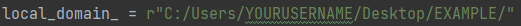
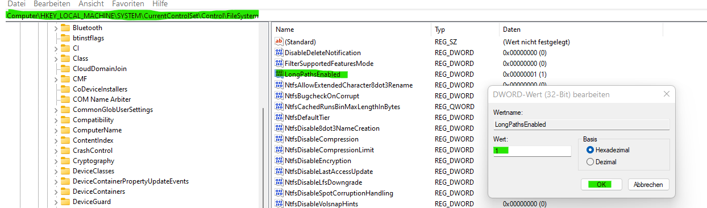

# Readme  still in progress
# DWD_Project

Code created with PyCharm Professional Student Version.

Interpreter: Python 3.10

Tested on Windows 11 Pro 64-Bit Version


>CPU: Intel Core i7 12700K
> 
> RAM: DDR5 32 GB
> 
> GPU: NVIDIA 3080 
>
# Used Packages
```
pip install os 
pip install ipyleaflet
pip install IPython.display / pip install IPython
pip install json
pip install itertools
pip install datetime
pip install bs4
pip install requests
pip install zipfile
pip install tkinter
pip install tkintermapview
pip install numpy
pip install scipy.spatial / pip install scipy
pip install matplotlib.pyplot / pip install matplotlib
pip install pandas
pip install gc
```
# Open Data sources
### Deutscher Wetterdienst
>
> 
>https://opendata.dwd.de/climate_environment/CDC/observations_germany/climate/
### Open Streetmap 
>© OpenStreetMap-Mitwirkende siehe www.openstreetmap.org/copyright und www.opendatacommons.org

# Setup your code
## important files
>DwdMapCreater: generate a map in JupyterNotebook.
>
>DwdDict: set up your dictionaries.
>
>DwdGui: in progress. Will start a GUI in future.
>
>main: will be a compressed file for the setup.
## important setups
>add a **local_domain_** for yout data @main.py 
> 
> Create a folder named "Graphs" inside your **local_domain_** for your plots.
> 
> Put DWD_project inside **the local_domain_**
## important variables @main.py
>**looking_for_ = []** : Tells what type of measurement you are looking for. Check **DwdDict.py, title_dict**
> 
>**start_date_ and end_date_ = int(YYYYMMDDhhmm)**  : Tells the range of data you are looking for
> 
>**x_coordinate_ and y_coordinate_ = int(Long) and int(Lat)** : Latitude coordinates in germany
> 
>**z_coordinate_ = int(height)** : You can skip it for now
> 
>**k_factor_ = int()** : Tells how many stations you are looking for around the Latitude coordinates
> 
> **type_of_data_ = str()** : Tells what type of data you are looking for. Check **DwdDict.py, type_of_data_list**
> 
> **type_of_time_ = str()** : Tells what type of time you are looking for Check **Dwddict.py, type_of_time_list**

## important functions @main.py
> **dwd.main_plotter_data()** # compare=False as standard
> 
> **dwd.main_station_array()**
> 
> **dwd.main_station_information()**
> 
> **dwd.main_datascrapper()** # all=False as standard. Will download the type_of_data_ for you
> 
> **dwd.main_writer()** # type_of_data_list=None, type_of_time_list=None as standard
>  
> **dwd.main_data_map()** # will create coordinate .json data for your JupyterNotebook Map
> 
> **dwd.main_plotter_stations()** # projection=False as standard
> 
## Avoid Windows bugs
> to avoid any Windwos bugs, you need to change the max. length of any path
> 
> Press **Win+R** > **REGEDIT** > HKEY_LOCAL_MACHINE\SYSTEM\CurrentControlSet\Control\FileSystem
> 
> go to LongPathEnabled and set it to **1**
> 
> Note: If LongPathsEnabled is not available in your list. Right click and create **LongPathEnabled**
> 
> Choose the DWORD (32-bit) Value if your creating a new DWORD