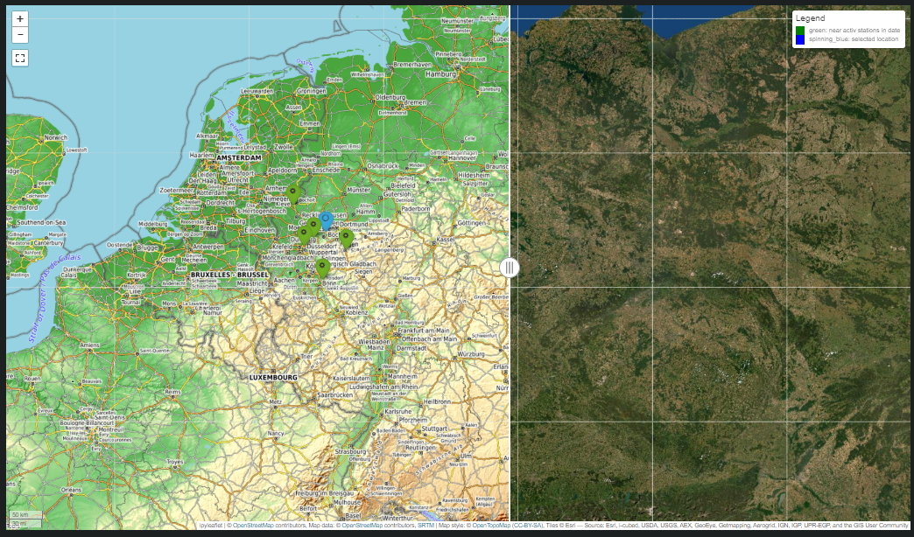

# Readme  still in progress
# DWD_Project

Code created with PyCharm Professional Student Version.

Interpreter: Python 3.10

Tested on Windows 11 Pro 64-Bit Version


>CPU: Intel Core i7 12700K
> 
> RAM: DDR5 32 GB
> 
> GPU: NVIDIA 3080 
>
> 
# Used Packages
```
pip install os 
pip install ipyleaflet
pip install IPython.display / pip install IPython
pip install json
pip install itertools
pip install datetime
pip install bs4
pip install requests
pip install zipfile
pip install tkinter
pip install numpy
pip install scipy.spatial / pip install scipy
pip install matplotlib.pyplot / pip install matplotlib
pip install pandas
pip install gc
```
# Open Data sources
### Deutscher Wetterdienst
>
> 
>https://opendata.dwd.de/climate_environment/CDC/observations_germany/climate/
### Open Streetmap 
>© OpenStreetMap-Mitwirkende siehe www.openstreetmap.org/copyright und www.opendatacommons.org

# Setup your code
## important files
>DwdMapCreater: generate a map in JupyterNotebook.
>
>DwdDict: set up your dictionaries.
>
>DwdGui: in progress. Will start a GUI in future.
>
>main: will be a compressed file for the setup.
## important setups
>add a **local_domain_** for yout data @main.py 
> 
> Create a folder named "Graphs" inside your **local_domain_** for your plots.
> 
> Put DWD_project inside the **local_domain_**
## Define your class with main_dwd() as *dwd*
```
from DwdMain import main_dwd
dwd = main_dwd(local_domain,
             type_of_data,
             type_of_time,
             start_date=None,
             end_date=None,
             compare_station=None,
             x_coordinate=None,
             y_coordinate=None,
             z_coordinate=None,
             k_factor=None,
             looking_for=None)
```
> ### Variables
>- >**local_domain as Raw String**: Is the local path, where everything will be processed
>- >**type_of_data as String**: Tells what type of data you are looking for. Check **DwdDict.py, type_of_data_list**
>- >**type_of_time as String** : Tells what type of time you are looking for Check **Dwddict.py, type_of_time_list**
>- >**start_date and end_date as Integer**: define the timedelta you are looking for. (Note: YYYYMMDDhhmm)
>- >**compare_station as String**: If you compare the precision of the mean method you need to chooce a 
   > Station you want to compare with. (Example: "TU_00003" or "solar_00003")
>- >**x_coordinate, y_coordinate, z_coordinate as float**: Define the location in germany (Latitude coordinates). You can 
   leave z_coordinate=0 for now. 
>- >**k_factor as integer**: Will look for this amount of Stations around your Latitude coordinates
>- >**looking_for as String**: Tells what type of measurement you are looking for. Check **DwdDict.py, title_dict**
> ### Methods
> Get your data first!
>- >**dwd.main_datascrapper(all=False)**: Will web-scrap DWD-Data from CDC. Check 
**DwdDict.py, external_domain and external_path_global**. If all=False, it will download **type_of_data** for you. If all=True,
   > it will download: check **DwdDict.py, type_of_data_list**
   > 
> Prepare some stuff first!
>- >**dwd.main_writer(all=False)**: Will prepare the data, for faster loading times.Same rules for arg:all as for **main_datascrapper()**
   > 
> Get some information about any Station:
>- >**dwd.main_station_information("")**: "TU_00003" for example
   > 
>Get the location and all available and activ stations in timedelta:
>- >**x_coordinate, y_coordinate, z_coordinate, stations = dwd.main_activ_stations_in_date()**
   > 
>Get the whole station ID array
>- >**dwd.main_station_array()**
   > 
> Plot all the locations of all stations 2D and 3D
>- >**dwd.main_plotter_stations(projection=False)**: if projection==True. It will project all the heights in your 3D-plot
   >
> Plot your data
>- >**dwd.main_plotter_data(compare="False")** args for compare: **"False"**, **"pltcompare"**, **"justcompare"**.
   > **"False"** is for any location in germany. **"pltcompare"** will compare a station with the **mean method** 
   > and create a plot. **"justcompare"** will just comapre the data with a station and return **maximum(absolute error)** 
   > and **avg_diff**
> 
> Will prepare data for a map (open DwdMapCreator to generate a map)
>- >**dwd.main_data_map()**
   Example: 
 
## Avoid Windows bugs
> to avoid any Windwos bugs, you need to change the max. length of any path
> 
> Press **Win+R** > **REGEDIT** > HKEY_LOCAL_MACHINE\SYSTEM\CurrentControlSet\Control\FileSystem
> 
> go to LongPathEnabled and set it to **1**
> 
> Note: If LongPathsEnabled is not available in your list. Right click and create **LongPathEnabled**
> 
> Choose the DWORD (32-bit) Value if your creating a new DWORD
>