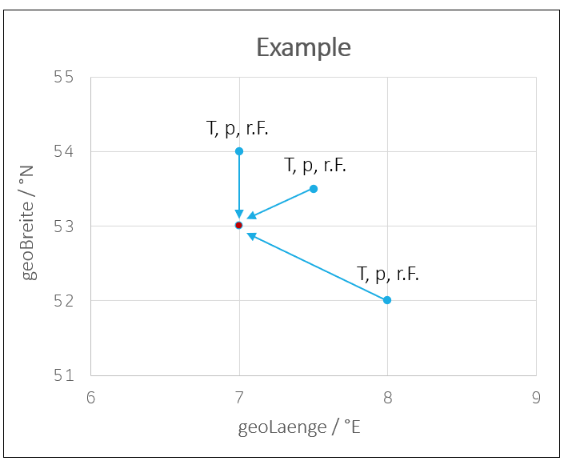
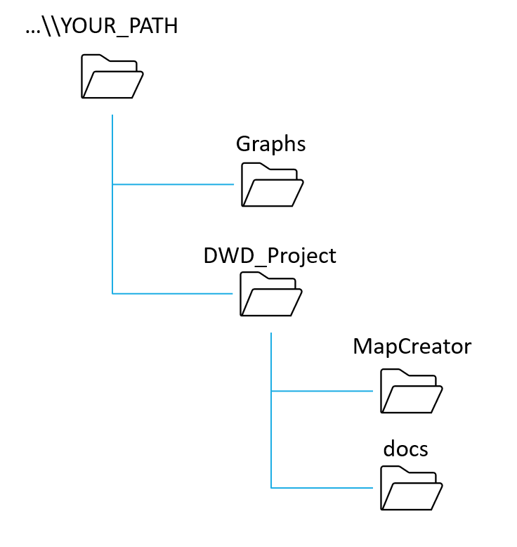
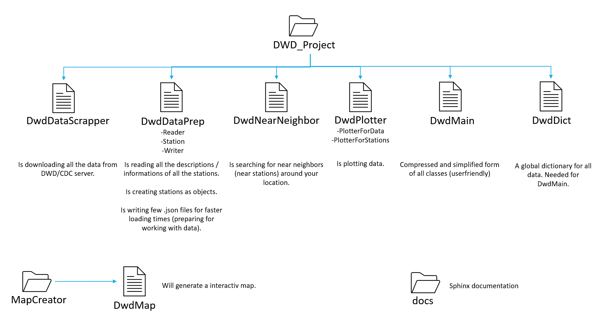

.. contents:: Table of Contents (for introduction)
    :depth: 3

Introduction
=======================================

The goal of the whole project is to find a solid calculation for a chosen geolocation in germany. So for example, if we choose a geolocation in germany, we want to feed this location with some data to generate a curve.
Here we choose for example the method "standard average". It means, it will find k-stations (number) around your location and get the data from this stations to generate a curve for your location. See following figure.

So this figure tells us, that our chosen location is 7°E and 53°N and we found 3 next stations around our location. Now we can get the data of this 3 stations and make an average of this data. So we can feed our location
with this data.

For achieving this goal, we have some structure in this project. The two following figures describing the structure and the functions of our project. To understand how this project works in detail, you need to understand
the structure of DWD/CDC. So you should go to the following URL: https://www.dwd.de/DE/leistungen/opendata/opendata.html and try to understand the structure first. What data do we have? What is the resolution?
Where do i find information about any station? [...]. So make a picture for your own first, before you start working on this project.

